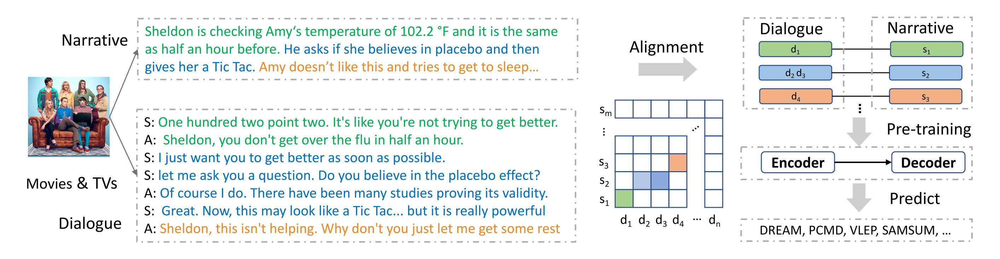

# DIANA: a Dialogue Narration Dataset




### What is DIANA?

DIANA is a large-scale dialogue-narrative parallel corpus that is proposed in our ACL 2022 paper [Learning-by-Narrating: Narrative Pre-Training for Zero-Shot Dialogue Comprehension](https://aclanthology.org/2022.acl-short.23.pdf).
It contains 243K (DIAlogue, NArrative) pairs derived from subtitles and synopses of 47,050 English movies and TV episodes.

To facilitate the training of current NLP models, we first split subtitles and synopses into smaller segments. 
Then we align the related segments from each part to shorter (dialogue, narrative) pairs using the dynamic time warping method. 

### Why use DIANA?

Comprehending a dialogue requires a model having diverse capabilities such as paraphrasing, summarizing, narrating, and reasoning. 
(Dialogue, narrative) pairs in DIANA naturally bridge the format and style gaps 
between the dialogues (from multiple speakers) and narratives (from a narrator). 

Besides that, narratives in DIANA reveal varying knowledge types such as summarizing, visual/audial knowledge, 
paraphrasing, text matching, implicit knowledge, causal relationships, and interpersonal relationships. 
The diverse knowledge types in DIANA will benefit dialogue-related downstream tasks such as conversational MRC and dialogue summarization.


### How to use DIANA?

As an example, we provide a "learning-by-narrating" strategy to further pre-train a seq-2-seq model on DIANA before applying it to downstream tasks. 
We show that our model outperforms strong baselines on varying downstream tasks under a zero-shot setting. 
We also observe that DIANA can outperform the vanilla pre-trained models when finetuned on downstream tasks.

We hope that DIANA will promote future research in various ways.


### Download

We provide a sampled dataset in this repository that contains 1k (dialogue, narrative) pairs. 
To download the entire dataset, please fill in this [Google Form](https://forms.gle/hKjQHTrxuvj9WmZU9)
and we'll send the link to your email address within a week.


### Related Dataset
If you are interested in understanding and summarizing narratives, welcome to check out [NarraSum](https://github.com/zhaochaocs/narrasum), 
a large-scale abstractive narrative summarization dataset proposed in our 
EMNLP Findings 2022 paper [NARRASUM: A Large-Scale Dataset for Abstractive Narrative Summarization](https://arxiv.org/abs/2212.01476).
It contains 122K (Document, Summary) pairs collected from plot descriptions of 22.8K unique movies and 28.5K unique TV episodes


### Citation 

```bibtex
@inproceedings{zhao2022learning,
  title={Learning-by-Narrating: Narrative Pre-Training for Zero-Shot Dialogue Comprehension},
  author={Zhao, Chao and Yao, Wenlin and Yu, Dian and Song, Kaiqiang and Yu, Dong and Chen, Jianshu},
  booktitle={Proceedings of the 60th Annual Meeting of the Association for Computational Linguistics (Volume 2: Short Papers)},
  pages={212--218},
  year={2022}
}
```


